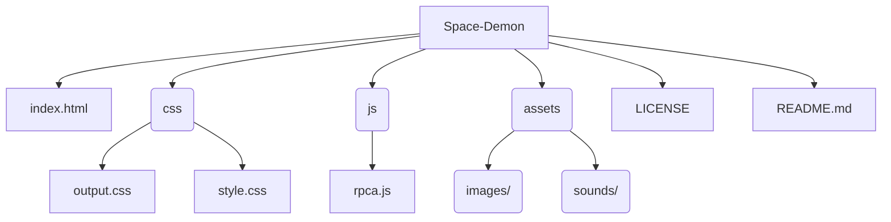

# 🛡️ Space Demon

> **A neon‑soaked, five‑weapon twist on the classic Rock Paper Scissors — defeat the Space Demon before it drains your health!**

&#x20; &#x20;

---

---

## Table of Contents

1. [Features](#features)
2. [Tech Stack](#tech-stack)
3. [Folder Architecture](#folder-architecture)
4. [Getting Started](#getting-started)
5. [Gameplay Rules](#gameplay-rules)
6. [Contributing](#contributing)
7. [License](#license)

---

## ✨ Features

- **Five‑Weapon Combat** — Saber (🪨 Rock), Ray Gun (📄 Paper), Artillery (✂️ Scissors), Space Magic (🦎 Lizard), Space Monster (🖖 Spock).
- **Health Bars** — Both you and the Space Demon start with 10 HP; first to 0 loses.
- **Dynamic Animations** — GSAP‑powered reveals, pulsing neon text, hit flashes, and more.
- **Sound Design** — Weapon SFX, round win/lose/draw jingles, BGM, and epic victory/defeat themes.
- **Responsive UI** — Tailwind utility classes keep everything looking sharp on any device.
- **One‑Click Rematch** — Jump straight into the next battle without refreshing.

---

## 🛠️ Tech Stack

| Layer         | Tools                                                   |
| ------------- | ------------------------------------------------------- |
| **Structure** | HTML5                                                   |
| **Styling**   | Tailwind CSS (compiled to `css/output.css`), custom CSS |
| **Logic**     | Vanilla JavaScript (`js/rpca.js`)                       |
| **Animation** | GSAP 3 (GreenSock)                                      |
| **Assets**    | PNG/JPG images, MP3 audio                               |

---

## 📂 Folder Architecture



---

## 🚀 Getting Started

1. **Clone the repo**

   ```bash
   git clone https://github.com/Adytia855/Space-Demon.git
   cd Space-Demon
   ```

2. **Open **``

   No build step required — simply open the file in your favourite browser:

   ```bash
   # macOS/Linux
   open index.html

   # Windows (PowerShell)
   start index.html
   ```

3. **Play!**

   Choose your weapon, watch the animations, and try to drain the Space Demon’s HP before yours hits zero.

### Optional: Live Server

For automatic reloads during development you can use VS Code’s **Live Server** extension or run a lightweight HTTP server:

```bash
npx serve .    # requires Node.js
```

---

## 🕹️ Gameplay Rules

- **Weapon Match‑ups**

  | Your Weapon   | Beats ➡️      | Loses ⬅️      |
  | ------------- | ------------- | ------------- |
  | Saber         | Artillery     | Ray Gun       |
  | Ray Gun       | Saber         | Space Monster |
  | Artillery     | Space Monster | Saber         |
  | Space Magic   | Ray Gun       | Artillery     |
  | Space Monster | Space Magic   | Ray Gun       |

- **Rounds** — Each click triggers a round. Outcome is displayed along with an in‑universe reason.

- **Health** — Round winners inflict 1 HP damage. First to reach 0 HP loses.

- **Rematch** — Click **Rematch?** to reset everything and play again.

---

## 🤝 Contributing

Pull requests are welcome! If you have new weapon ideas, animation tweaks, or soundtracks:

1. **Fork** the project
2. **Create** your feature branch `git checkout -b feature/AmazingFeature`
3. **Commit** your changes `git commit -m 'feat: add AmazingFeature'`
4. **Push** to the branch `git push origin feature/AmazingFeature`
5. **Open** a Pull Request

Please keep PRs focused and include screenshots/GIFs for UI changes.

---

## 📜 License

Distributed under the MIT License. See [`LICENSE`](LICENSE) for more information.

---

> *Made with ✨ and a dash of 👾 by *[*@Adytia855*](https://github.com/Adytia855)

